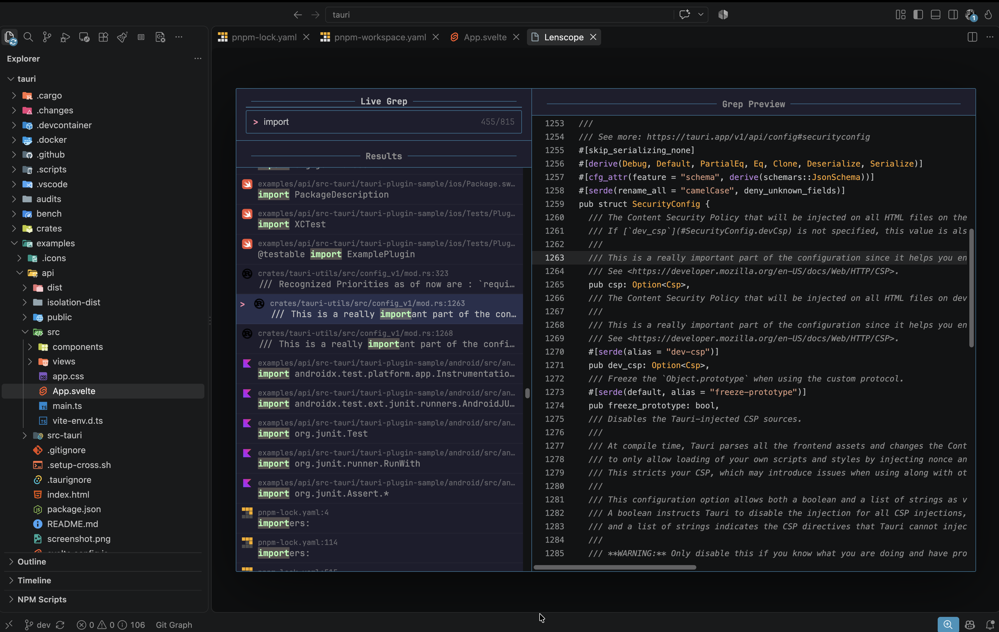
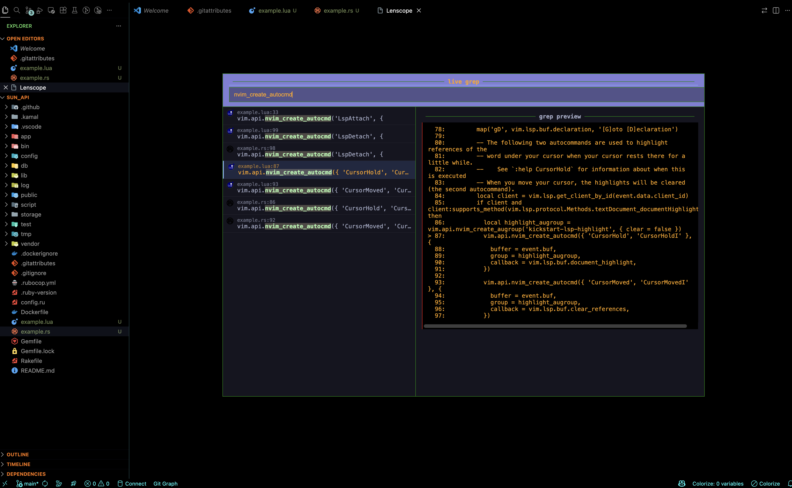

# Lenscope

**WORK IN PROGRESS**

Gaze deeply into unknown regions using the power of the moon 🔭.
## 🖼️ Screenshots




## What Is Lenscope?
 
`lenscope` is a [telescope.nvim](https://github.com/nvim-telescope/telescope.nvim) inspired fuzzy finder for Visual Studio Code powered by  [ripgrep](https://github.com/BurntSushi/ripgrep).

## What Is ripgrep?

ripgrep is a line-oriented search tool that recursively searches directories for a regex pattern. By default, ripgrep will respect gitignore rules and automatically skip hidden files/directories and binary files.

## Getting Started

VS Code [>v1.120.0](https://github.com/microsoft/vscode/releases/tag/1.120.0) or the latest insiders build is required for `lenscope` to work.


### Required dependencies

- [ripgrep](https://github.com/BurntSushi/ripgrep) is required for `live_grep` and is the first priority for `find_files` features.


### Installing ripgrep

The binary name for ripgrep is `rg`.

If you're a **macOS Homebrew** or a **Linuxbrew** user, then you can install
ripgrep from homebrew-core:

```
$ brew install ripgrep
```

If you're a **Windows Chocolatey** user, then you can install ripgrep from the
[official repo](https://chocolatey.org/packages/ripgrep):

```
$ choco install ripgrep
```

If you're a **Windows Scoop** user, then you can install ripgrep from the
[official bucket](https://github.com/ScoopInstaller/Main/blob/master/bucket/ripgrep.json):

```
$ scoop install ripgrep
```

If you're a **Windows Winget** user, then you can install ripgrep from the
[winget-pkgs](https://github.com/microsoft/winget-pkgs/tree/master/manifests/b/BurntSushi/ripgrep)
repository:

```
$ winget install BurntSushi.ripgrep.MSVC
```

## Development
### Prerequisites
- Node.js 24 LTS
- npm
- VS Code
- ripgrep (rg)
   
### Setup

Clone the repository:

```
$ git clone https://github.com/TBadru/lenscope.git
```

```
$ cd lenscope
```

Use the project's Node version:

```
$ nvm use
```
Install dependencies:
```
$ npm ci
```
Verify everything is working:
```
$ npm run check-types
```
```
$ npm run lint
```
```
$ npm test
```
### Running the Extension

Open the project in VS Code and press:

F5

This launches an Extension Development Host with `Lenscope` loaded and accessible from the Command palette.

## Tooling

Lenscope currently uses:

- TypeScript

- Vitest

- ESLint

- esbuild

- npm

The committed package-lock.json is the source of truth for dependency versions.

## Features/Functions

Lenscope built-in features/functions soo far;


| Functions             | Description                                                                                                                                                              |
| --------------------- | ------------------------------------------------------------------------------------------------------------------------------------------------------------------------ |
| `live_grep`   | Search for a string in your current working directory and get results live as you type, respects .gitignore    ✅        |
| `find_files`  | Lists files in your current working directory, respects .gitignore ❌
| `current_buffer_fuzzy_find` | Live fuzzy search inside of the currently open buffer ❌


## License

[The Unlicense](https://github.com/TBadru/lenscope/blob/main/LICENSE)
